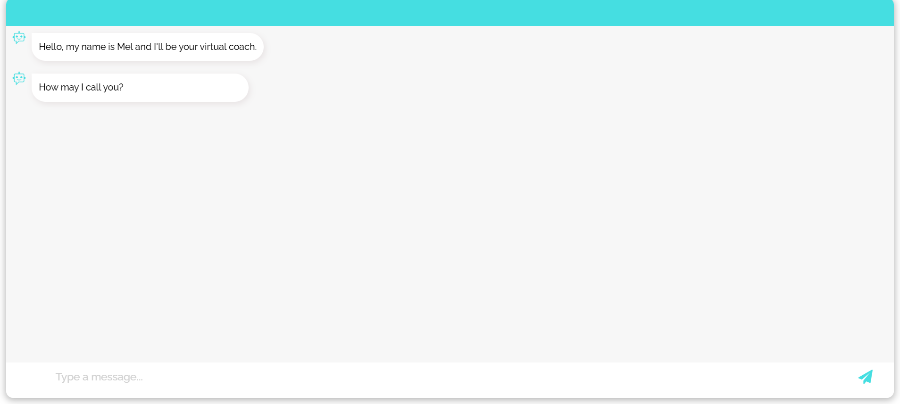

# virtual_coach_useful_activities

This is the implementation of the virtual coach Mel that proposes preparatory activities for quitting smoking and becoming more physically active in up to 5 conversational sessions. Besides proposing preparatory activities, Mel also proposes activities that are meant to persuade people of the usefulness of certain competencies for quitting smoking.

The code is based on [this Github repository](https://github.com/AmirStudy/Rasa_Deployment), [the work by Tom Jacobs](https://github.com/TomJ-EU/rasa/tree/dev), as well as [the implementation of the virtual coach Sam](https://github.com/PerfectFit-project/virtual_coach_rl_persuasion_algorithm).

## Conversation Structure

Each user can have up to 5 conversational sessions with Mel. These sessions have this structure:

A demo video of the second conversational session can be found [here](https://youtu.be/RywcZSHOs_g).

## Components

This virtual coach consists of a backend based on Rasa Open Source 3.2.8 (backend), a custom action server (actions), a frontend (frontend), a database (db), an SQLTrackerStore, and Nginx.

## Setup on Google Compute Engine

To run this project on a Google Compute Engine, I followed these steps:

   - Create a Google Compute Engine instance:
	  - Use Ubuntu 20.04.
	  - Make sure that the location is in Europe.
	  - Enable http and https traffic.
	  - Choose a small instance for the start, since you have to pay more for larger instances. I started with an e2-medium machine type and 100GB for the boot disk.
	  - The first 3 months you have some free credit.
      - Follow the instructions from [here](https://github.com/AmirStudy/Rasa_Deployment) in the sense that you “allow full access to all cloud APIs” on the Google Compute Engine instance. This is shown in this video: https://www.youtube.com/watch?v=qOHszxJsuGs&ab_channel=JiteshGaikwad. Also see this screenshot:
   
      
   
   - Open port 5005 for tcp on the Compute Engine instance:
	
   
	
   
	
   
	
   
   
   
	
   - Follow the instructions from [here](https://github.com/AmirStudy/Rasa_Deployment) for installing Docker on the Google Compute Engine instance. You can do this via the command line that opens after you click on "SSH":
   
   
	
   - Install docker-compose on the instance:
	  - I followed the steps described [here](https://levelup.gitconnected.com/the-easiest-docker-docker-compose-setup-on-compute-engine-ec171c09a29a):
	     - `curl -L "https://github.com/docker/compose/releases/download/1.26.2/docker-compose-$(uname -s)-$(uname -m)" -o /usr/local/bin/docker-compose`
	     - `chmod +x /usr/local/bin/docker-compose`
	     - You might need to add `sudo` in front of the commands to make them work.
   - I suggest getting a static IP address for your Google Compute Engine instance:
      - Follow the instructions [here](https://cloud.google.com/compute/docs/ip-addresses/reserve-static-external-ip-address).
	  - You have to pay for every month, but it is rather cheap.
   - Make sure you turn off your instance whenever you do not need it, as you are charged for the time that it is up.
   - If you are NOT using Nginx, set the IP address of your Google Compute Engine instance in the function `send(message)` in the file frontend/static/js/script.js: `url: "http://<your_instance_IP>:5005/webhooks/rest/webhook"`.
      - When you run the project locally, use `url: "http://localhost:5005/webhooks/rest/webhook"`.
   - Clone your project from Github on the Google Compute Engine instance.
   - Navigate to your project folder on the Compute Engine instance and start your project with `docker-compose up`.
   - Check if all your containers are running on your Google Compute Engine instance via `docker container ls`.
   - You can access the frontend from your browser via `http://<your_instance_IP>/?userid=<some_user_id>&n=1`. `n` determines which session is started (1-5). Earlier sessions need to be completed by a user to be able to access later ones.
      - If you are not using Nginx, you also need to specify the port number: `http://<your_instance_IP>:3000/?userid=<some_user_id>&n=1`.
   
   - The chat should look something like this:
   
   
   
   
This project uses an [SQLTrackerStore](https://rasa.com/docs/rasa/tracker-stores/) to store the conversation history in a database:
   - The database is persistent because of the "volumes" we specified in docker-compose.yml for postgres. Read more about this [here](https://medium.com/codex/how-to-persist-and-backup-data-of-a-postgresql-docker-container-9fe269ff4334).
      - So you can run `docker-compose down --volumes` and `docker-compose up --build` and the database content is still there. Check for yourself using DBeaver.
	  - To delete the database content, just remove the "data"-folder on your Google Compute Engine instance.

The project further uses an mysql database to store specific data from the conversations:
   - The database is also persistent. The folder "data_mysql" is used for this, as set up in docker-compose.yml.
   - To delete the database content, just delete the folder "data_mysql" on your Google Compute Engine instance.
   - There are two tables:
      - sessiondata: stores data from the sessions that we want to save (e.g., mood, experience with previous activity).
      - users: stores the username for each user (set in session 1).

Some errors I got during the setup:
   - "Couldn't connect to Docker daemon at http+docker://localhost - is it running? If it's at a non-standard location, specify the URL with the DOCKER_HOST environment variable“ when running `docker-compose up –-build`.
      - I followed the steps suggested [here](https://forums.docker.com/t/couldnt-connect-to-docker-daemon-at-http-docker-localhost-is-it-running/87257/2).
	  - These 2 steps fixed the issue for me:
	     
		 
		 
		 - Run `sudo docker-compose up –-build`. 
		
   - When running the project locally on Windows, I got an error for the SQLTrackerStore when running `docker-compose up –-build`. Just removing the information on `volumes` in docker-compose.yml helped. This removes the persistence though.

## License

Copyright (C) 2023 Delft University of Technology.

Licensed under the Apache License, version 2.0. See LICENSE for details.